# Address Flow Tracking Model

Efficiently tracks Bitcoin fund flows between predefined address groups using EasyLayer framework. 

## 🎯 Purpose

This aggregate tracks:
- 🔍 **Active fund flows** between predefined address groups (exchanges, mixers, blacklisted addresses)
- 🛡️ **Risk scoring** based on source/destination group combinations and flow characteristics
- 📊 **Flow summaries** with aggregated statistics between group pairs
- ⚡ **Real-time detection** of suspicious money flows with confidence tracking

## 🔄 Algorithm Flow

```mermaid
graph TD
    A[New Block] --> B[Parse Transactions]
    
    B --> C[Extract Outputs to Tracked Groups]
    C --> D{Output belongs to<br/>tracked group?}
    D -->|YES| E[Create FlowPath Event]
    D -->|NO| F[🤷 IGNORE]
    
    E --> G[Process Flow Path]
    G --> H{Is this continuing<br/>existing flow?}
    
    H -->|YES| I[Continue Flow<br/>• Update address<br/>• Decay confidence<br/>• Add to path]
    H -->|NO| J{Is source from<br/>tracked group?}
    
    J -->|YES| K[Start New Flow<br/>• Create FlowTracker<br/>• Set confidence=1.0]
    J -->|NO| L[🤷 IGNORE]
    
    I --> M{Reached destination<br/>group?}
    K --> M
    M -->|YES| N[Complete Flow<br/>• Record summary<br/>• Calculate risk score]
    M -->|NO| O[Continue tracking]
    
    subgraph "Memory Management"
        P[Max 10k active flows]
        Q[Max 5k flow summaries]  
        R[Max 3 hops in path]
        S[Prune old flows daily]
    end
    
    subgraph "Flow States"
        T[🆕 Active: being tracked]
        U[✅ Completed: reached destination]
        V[❌ Pruned: confidence too low]
        W[🗑️ Aged out: too old]
    end
```



## 📊 Step-by-Step Processing

### 1. **Flow Detection**
```typescript
// Check if output belongs to tracked groups
const address = extractAddressFromVout(output, networkConfig);
if (this.addressToGroups.has(address)) {
  // Fast O(1) lookup using optimized script matching
  const flowPath: FlowPath = {
    txid, blockHeight, toAddress: address, 
    amount, confidence: 1.0
  };
  detectedFlows.push(flowPath);
}
```

### 2. **Flow Continuation (O(1) Lookup)**
```typescript
// Optimized: O(1) instead of O(N) iteration
const activeFlowIds = this.addressToActiveFlows.get(fromAddress);
if (activeFlowIds) {
  for (const flowId of activeFlowIds) {
    const flow = this.activeFlows.get(flowId);
    if (flow?.isActive) {
      this.continueFlow(flowId, toAddress, amount, confidence, blockHeight);
    }
  }
}
```

### 3. **Flow Completion & Risk Scoring**
```typescript
// When flow reaches destination group
const riskScore = this.calculateFlowRiskScore(summary);
// Risk factors:
// - Source group risk level (CRITICAL=0.5, HIGH=0.3, MEDIUM=0.1)
// - Destination group risk level (weighted 0.6x)
// - Large amounts (>1000 BTC = +0.1)
// - High hop count (>4 hops = +0.1, indicates obfuscation)
```

### 4. **Memory Management (Daily)**
```typescript
if (blockHeight % 144 === 0) { // Every 144 blocks = ~daily
  this.pruneOldFlows(blockHeight);        // Remove aged flows
  this.limitActiveFlows();               // Keep max 10k flows
  this.limitFlowSummaries();             // Keep max 5k summaries
  this.truncateFlowPaths();              // Limit paths to 3 addresses
}
```

## 🎯 Predefined Address Groups

Configure your tracked groups by editing `PREDEFINED_GROUPS`:

```typescript
{
  id: "binance-hot-wallets",
  name: "Binance Hot Wallets",
  type: "EXCHANGE", 
  addresses: {
    "34xp4vRoCGJym3xR7yCVPFHoCNxv4Twseo": ["76a914...ac", "a914...87"], // Multiple scripts per address
    "bc1qm34lsc65zpw79lxes69zkqmk6luv9mwsqstqlh": ["0014...f6"],         // Single script
    "1A1zP1eP5QGefi2DMPTfTL5SLmv7DivfNa": []                            // No scripts = fallback parsing
  },
  riskLevel: "LOW",
  isSource: true,      // Can flows originate from this group?
  isDestination: true  // Can flows end at this group?
}
```

## 💾 Memory Usage Analysis

### **Constant Memory Growth Pattern**
- **Initial growth**: ~1.5MB for 10k flows + 1k summaries
- **Growth stops at**: ~2.5MB when prune limits reached  
- **Memory becomes CONSTANT** through aggressive pruning

### **What We Store vs Don't Store**

| Component | Store ✅ | Don't Store ❌ | Memory Impact |
|-----------|----------|----------------|---------------|
| **Active Flows** | Last 10,000 flows | Old/inactive flows | ~1.2MB |
| **Flow Summaries** | Last 5,000 summaries | Ancient summaries | ~1MB |
| **Flow Paths** | Last 3 addresses | Full transaction history | ~300KB |
| **Address Groups** | Predefined groups only | All blockchain addresses | ~30KB |

### **Memory Optimizations Applied**
1. **Numeric IDs**: `flowId: number` (4 bytes) vs UUID strings (36 bytes) = **9x savings**
2. **Sets vs Arrays**: O(1) operations + no duplicates
3. **Limited paths**: 3 addresses max vs unlimited = **50% savings**
4. **Aggressive pruning**: Daily cleanup of old data

## 🚀 Performance Optimizations

### **Critical Optimizations**
1. **O(1) Flow Lookup**: `addressToActiveFlows` index eliminates O(N) searches
2. **Script Pre-filtering**: Check known scripts before expensive parsing
3. **Set Operations**: O(1) add/remove from groups vs O(N) array operations
4. **Partial Sorting**: Only sort what needs removal during cleanup

### **Performance Characteristics**
- **Flow detection**: O(1) per output
- **Flow continuation**: O(1) lookup + O(1) update  
- **Memory cleanup**: O(N log N) only during daily maintenance
- **Risk scoring**: O(1) calculation per completed flow

## 🎯 Use Cases & Applications

### **Compliance & AML**
- **Exchange monitoring**: Track deposits from high-risk sources
- **Regulatory reporting**: Generate flow reports between entity types
- **Risk assessment**: Automatic scoring of transaction relationships

### **Investigation & Analysis**
- **Fund tracking**: Follow money from known criminal addresses
- **Pattern detection**: Identify mixing and laundering attempts
- **Whale monitoring**: Track large holder movements between exchanges

### **Example Queries**
```typescript
// Get highest risk flows
const topRisks = model.getTopRiskFlows(10);

// Track specific group activity  
const mixerFlows = model.getOutgoingFlows("suspicious-mixers");

// Time-based analysis
const weeklyStats = model.getFlowStatsForPeriod(currentBlock - 1008, currentBlock);

// Amount-based filtering
const largeFflows = model.searchFlowsByAmount("100000000000", "1000000000000"); // 1000-10000 BTC
```

## 🚨 Limitations & Considerations

### **Known Limitations**
1. **Group-dependent accuracy**: Only tracks flows between predefined groups
2. **Confidence decay**: Long transaction chains reduce tracking confidence  
3. **Memory bounds**: Extremely high activity may trigger aggressive pruning
4. **Script parsing**: Exotic script types may not be recognized

### **Best Practices**
1. **Keep groups updated**: Regularly update address groups with new known addresses
2. **Monitor memory usage**: Use `getStorageStats()` to track resource consumption
3. **Adjust thresholds**: Tune `MIN_TRACKED_AMOUNT` and confidence levels for your use case
4. **Regular analysis**: Review `getRiskAnalysis()` for emerging patterns

### **Configuration Tuning**
```typescript
// Adjust these constants based on your requirements:
private readonly MIN_TRACKED_AMOUNT = "1000000";     // 0.01 BTC minimum
private readonly MAX_HOPS = 6;                       // Maximum flow hops  
private readonly MIN_CONFIDENCE = 0.3;               // Minimum confidence to continue
private readonly CONFIDENCE_DECAY = 0.85;           // Confidence loss per hop
```